## Setup 

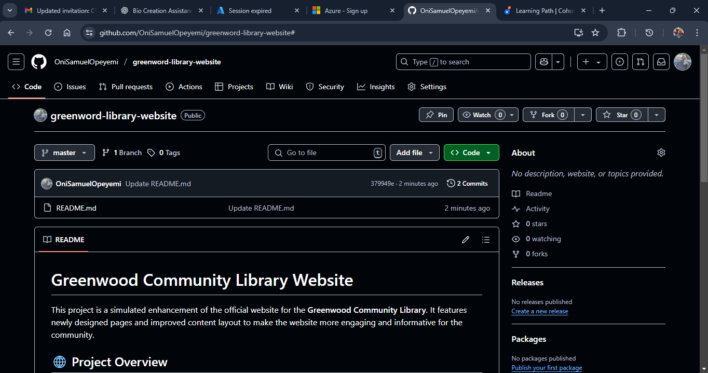

## cloned the Github repo on local computer

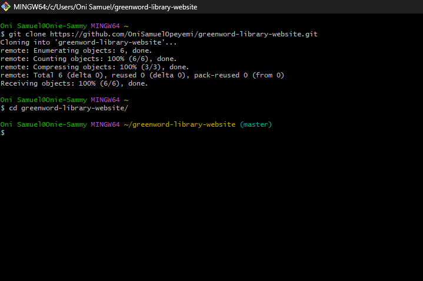

## Tasks

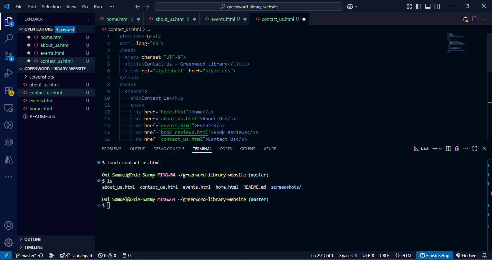

## Stage, commit and push changes 

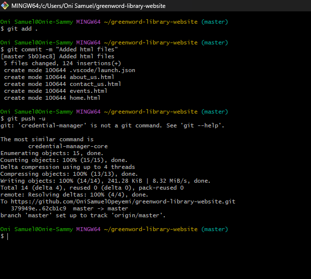

### Creat a new branch named **add-book-reviews**

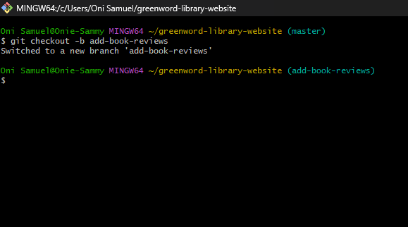

## Pushed morgan's change to remote 

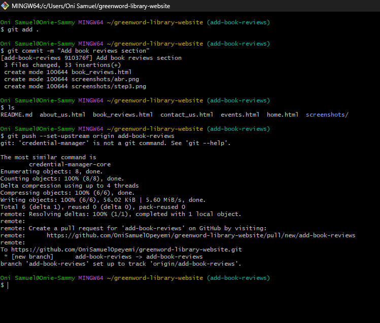

## Raised pull request for add-book-reviews branch 

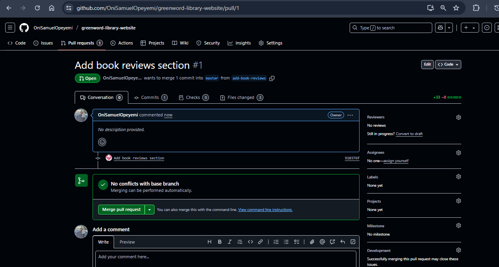

##Merge Morgan's PR 

## Created Update-events branch

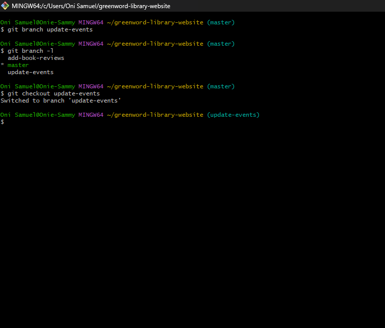

## Modified events.html 

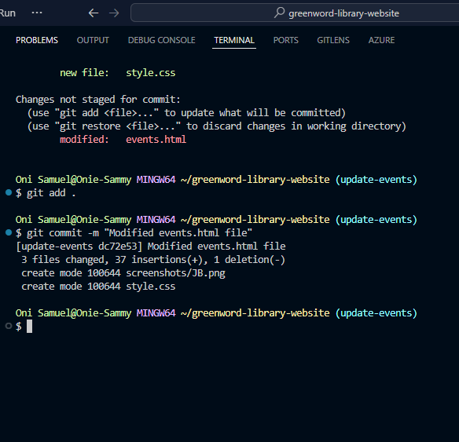

## Pushed changes to remote 

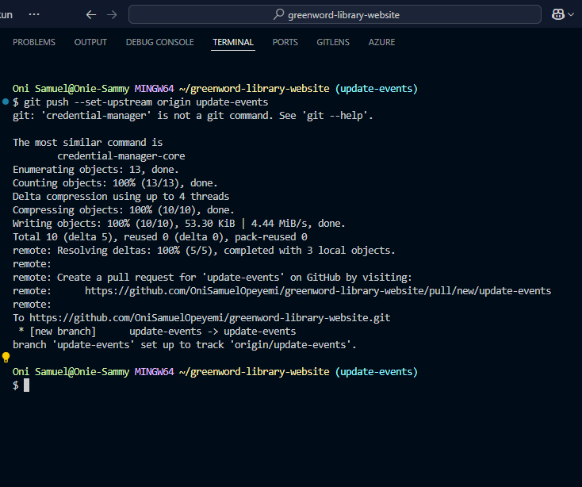

## Created Pull request for update-events branch 

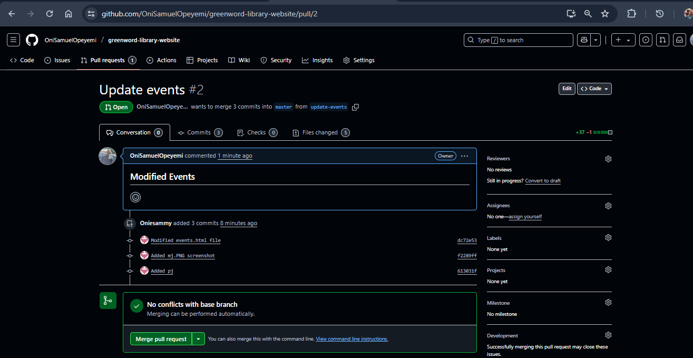

## Merged Update-events to master branch 

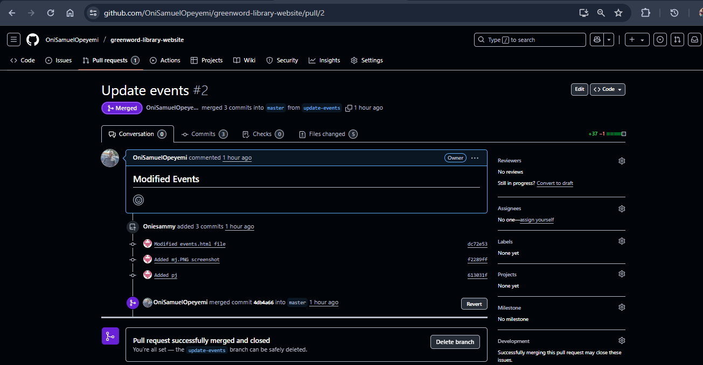